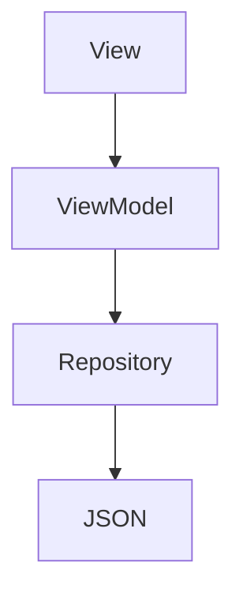

## DAds - *Ads for dads*

### About the task

The task is to fetch a set of datapoint from a remote JSON file, decode it and display the corresponding ads.

The app has one main functionality, which is listing an unknown number of elevated cards (ads). Secondary requested functionality is to be able to favourite cards, storing favourites offline, and sorting showing either all cards or only the favourites ones. The full list of task requirements are as follows:

-   Fetch ads from remote url 
-   Parse a dynamic JSON to display minimum properties: photo, price, location, title
-   Favorite any ad
-   Favorite ads should be available for offline viewing 
-   Switch between showing only favorite ads and showing all ad

### About the app

The app is called DAds, and is simply a marketplace with ads for dads (or anyone really).

Browsing stuff you may or may not need is fun and simple, and therefore the app should be fun and simple. The app should also be lightweight and easy to use. As the users are dads, the design should be somewhat masculine regarding choice of color and ui-elements.

The dad launches the app and is presented with a scrollable view of relatable dad-ads. The list is refreshed when pulled down. To assure nice scrolling performance ads are loaded into memory when we need it using the SwiftUI class LazyVStack.

The dad can also search for ads of his liking and can favourite items of interest. He can navigate to a view where some more info about the ad is shown. He can also see if the as is related to the ad-type ‘REALESTATE’ simply by making note of the icon next to its location. And he can see if the item is available through the shippingOption called "Fiks Ferdig".

Favorites are stored locally using UserDefaults. Note that there are some potential downsides with this approach, such as stored data is cleared if the app is re-installed, and the scalability. Read more on this issue [here](#regarding-offline-support).

Screenshots (iPhone 12) simulator:

  
### Before getting into coding

Initial thoughts on process the where to make sure that that the assignment is understood, that all the dependencies are available and visualise the coming app structure:

-   First of all - make sure to understand the task
-   Check the api and see what the dataset inhales
-   Create initial sketches/wireframes on paper
-   Plan for next dev. phase when developing
-   Assure lightweight app size and decent performance
-   Do not commit all at once
-   Make README notes continuously

  

## How to build and run the app

### Prerequisites

-   [Xcode](https://developer.apple.com/xcode/) IDE platform for macOS.
-   iPhone that can run your app, or simulated iOS device connected with USB.
-   Apple Developer account (if running the app on a device)

  

1.  Clone the repo
2.  Open the project in Xcode
3.  Run the app using Xcode and a simulator or physical device

  

### App architecture and design pattern

  

Application user interface is written in swiftUI. The project file structure consist of components divided into sections of concern.

A third-party tool was used to parse the data structure and create a Model of response: [https://app.quicktype.io/](https://app.quicktype.io/) 

Components should be re-usable and therefore the app is using MVVM (ModelView ViewModel) design pattern to separate logic from view. A viewModel is responsible for querying data in a repository. The repository is responsible for communicating with the backend. The repository consist of a single function to load JSON.

Landscape- and dark mode are not taken into consideration other than running predefined ui-tests at launch.
  

## Thoughts on the result

### Regarding offline support:

When creating a new project I chose not to include Core Data simply because of the time limitation and my lack of knowledge on the subject. Instead I chose to simply use AppStorage, a wrapper around UserDefauilts. Since the app might grow and setting up core data seems like the right option. User Default should mainly be used to store small pieces of data, like settings and such and Core Data is therefore a good solution for future development of DAds.

### Regarding testing:

Almost only unit- and ui-tests that have been run are the generic XCT tests generated when adding a test-target to Xcode projects. Very few automated tests have been written. The app is run and manually testet on simulator (iPhone 12 and iPhone 14Pro) and physical device (iPhone 13). Offline mode is tested on all devices, and loads list of favourites as expected but there are no other considerations of offline-mode regarding rendering of content. The app is run using VoiceOver on device and using Xcode Accessibility Inspector on simulator, to assure universal design. Some potential improvements where discovered to meet WCAG 2.1 dements, such as contrast, zoom and descriptions.

### Further development:

First of all, the project does contain code that would benefit from refactoring. An example is very similar views of rendering content of each of the two tabs (.All and .Favorites). In addition, there are a bunch of tasks to take on for further development. Here are some thoughts on low-hanging fruits for the future:

-   Calculate route. This requires lot- and lat- properties of the dataset thought and a location manager.
- The product landing page could be thicker if the backend included some more data points, such as multiple images for instance
-   Allow user to set up remote notifications and listen to newly posted ads
-   Should be able to sort by other things than favourites, example is nearest location and price
-   Adding support for multiple languages using LocalizedStringKey
-   Setting up a background thread for loading the large json and store locally
-   Pullrefresh should load only new ads
-   Use isFavorite bool from dataset, requires writing back
-   Write relevant tests, which is regarding data fetch where the goal should be to make sure that json decodes properly and throws any errors that are expected.
